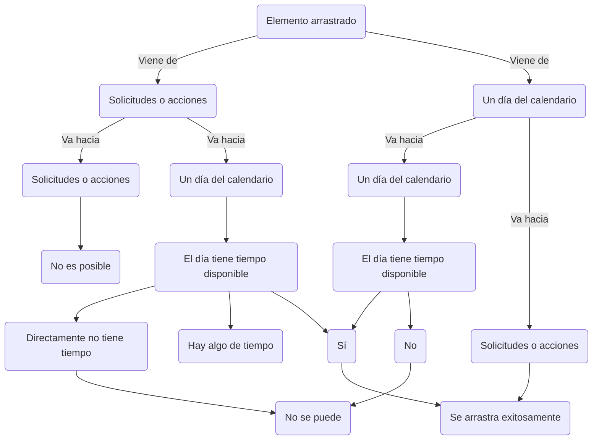

# Documentación aplicación de planeación cervecería versión 1.0.0

Proyecto desarrollado en React.js.

## Abstracción del proyecto

Se clona el repositorio y se guarda en la carpeta deseada, seguidamente se ejecutará `npm install` para instalar las librerías que el proyecto usa.

## Node-scripts disponibles en el proyecto

Para iniciar el proyecto una vez estando en la carpeta contenedora se ejecutará `npm start`.
Para generar una build a partir del proyecto abierto con sus cambios guardados `npm run build`.

# Generalidades

## Librerías

[MUI](https://mui.com/material-ui/) para el uso de sus componentes, estilización mediante `themes` y edición de estilos sin necesidad de un archivo `.css`.
[Redux-TK](https://redux.js.org/) para el uso de estados globales.
[Axios](https://axios-http.com/docs/intro) para el manejo de la comunicación con el backend.
[JSpdf](https://artskydj.github.io/jsPDF/docs/jsPDF.html) para la creación de archivos `.pdf` a partir de una configuración simple.
[Moment.js](https://momentjs.com/) y [Day.js](https://day.js.org/) para la utilización y manejo del formato `date` en `js`.
[UUIDv4](https://www.npmjs.com/package/uuidv4) para la creación de `id` únicos.
[React-beautiful-dnd](https://www.npmjs.com/package/react-beautiful-dnd) para la funcionalidad de `drag and drop`.
[Toastify](https://fkhadra.github.io/react-toastify/introduction/) para las alertas de `feedback`.

## Estructura de carpetas

Se usa una estructura plana dado que en fin último el proyecto solo cuenta con una única página.

- /src
  - [components](#components)
  - [helpers](#helpers)
  - [redux](#redux)
  - [requests](#requests)
  - App.jsx

# Funcionamiento

## Funcionalidad general

### Arrastrar y soltar

Al usar la librería de **React-beautiful-dnd** se requiere entonces la creación de tres componentes principales, el contexto de los componentes a utilizar [_DragDropContext_](#dragdropcontext), el componente arrastrado [_Draggable_](#draggable) y el dónde soltar el componente arrastrado [_Droppable_](#droppable).
De esta manera se crea entonces el contexto de la aplicación y los componentes [_Droppable_](#droppable), las solicitudes o pendientes por programar, las acciones o actividades y uno para cada día del calendario para un total de 9 contenedores donde se pueden soltar los elementos arrastrados.

#### DragDropContext

Es el conexto donde los [_Droppable_](#droppable) van a existir, se pueden tener varios contextos por aplicación, pero para el caso solo se utiliza uno.

#### Droppable

Son contenedores donde se pueden soltar los componentes [_Draggable_](#draggable) , estos cuentan con un `id` único, en pendientes por programar es `solicitudes`, en actividades es `acciones` y para los 7 que se encuentran en el calendario es la suma del nombre del salón y el día, por ejemplo: `1A|Lunes&14/05/2020`.

#### Draggable

Para el caso son las tarjetas, tanto de pendientes por programar como de actividades. Estas cuentan de igual manera con un `id` único que se genera a partir de la librería `uuid` y se asigna según se traen las solicitudes o acciones desde el backend y directamente se almacenan en el `state` con esta propiedad.

### Validaciones

Al seleccionar un [_Draggable_](#draggable) y soltarlo en un [_Droppable_](#droppable), se ejecuta el archivo `OnDragEnd.jsx`, el cual recibe su información y la información del `state`. Donde entonces realiza la validación de inicialmente de dónde proviene, puesto que, como se mencionó anteriormente, cada día del calendario es un [_Droppable_](#droppable) por sí solo desde donde se pueden arrastrar [_Draggable_](#draggable).
Si el `elemento arrastrado` viene de `solicitudes` y va hacia algún día de `calendario`, se valida si el día cuenta con horas suficientes,

# Getting Started with Create React App

This project was bootstrapped with [Create React App](https://github.com/facebook/create-react-app).

## Available Scripts

In the project directory, you can run:

### `npm start`

Runs the app in the development mode.\
Open [http://localhost:3000](http://localhost:3000) to view it in your browser.

The page will reload when you make changes.\
You may also see any lint errors in the console.

### `npm test`

Launches the test runner in the interactive watch mode.\
See the section about [running tests](https://facebook.github.io/create-react-app/docs/running-tests) for more information.

### `npm run build`

Builds the app for production to the `build` folder.\
It correctly bundles React in production mode and optimizes the build for the best performance.

The build is minified and the filenames include the hashes.\
Your app is ready to be deployed!

See the section about [deployment](https://facebook.github.io/create-react-app/docs/deployment) for more information.

### `npm run eject`

**Note: this is a one-way operation. Once you `eject`, you can't go back!**

If you aren't satisfied with the build tool and configuration choices, you can `eject` at any time. This command will remove the single build dependency from your project.

Instead, it will copy all the configuration files and the transitive dependencies (webpack, Babel, ESLint, etc) right into your project so you have full control over them. All of the commands except `eject` will still work, but they will point to the copied scripts so you can tweak them. At this point you're on your own.

You don't have to ever use `eject`. The curated feature set is suitable for small and middle deployments, and you shouldn't feel obligated to use this feature. However we understand that this tool wouldn't be useful if you couldn't customize it when you are ready for it.

## Learn More

You can learn more in the [Create React App documentation](https://facebook.github.io/create-react-app/docs/getting-started).

To learn React, check out the [React documentation](https://reactjs.org/).

### Code Splitting

This section has moved here: [https://facebook.github.io/create-react-app/docs/code-splitting](https://facebook.github.io/create-react-app/docs/code-splitting)

### Analyzing the Bundle Size

This section has moved here: [https://facebook.github.io/create-react-app/docs/analyzing-the-bundle-size](https://facebook.github.io/create-react-app/docs/analyzing-the-bundle-size)

### Making a Progressive Web App

This section has moved here: [https://facebook.github.io/create-react-app/docs/making-a-progressive-web-app](https://facebook.github.io/create-react-app/docs/making-a-progressive-web-app)

### Advanced Configuration

This section has moved here: [https://facebook.github.io/create-react-app/docs/advanced-configuration](https://facebook.github.io/create-react-app/docs/advanced-configuration)

### Deployment

This section has moved here: [https://facebook.github.io/create-react-app/docs/deployment](https://facebook.github.io/create-react-app/docs/deployment)

### `npm run build` fails to minify

This section has moved here: [https://facebook.github.io/create-react-app/docs/troubleshooting#npm-run-build-fails-to-minify](https://facebook.github.io/create-react-app/docs/troubleshooting#npm-run-build-fails-to-minify)
