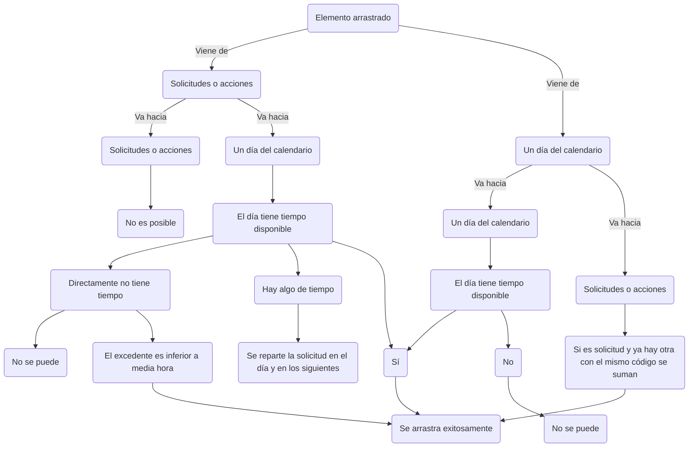

# Documentación aplicación de planeación cervecería versión 1.0.0

Proyecto desarrollado en React.js.

## Abstracción del proyecto

Se clona el repositorio y se guarda en la carpeta deseada, seguidamente se ejecutará `npm install` para instalar las librerías que el proyecto usa.

## Node-scripts disponibles en el proyecto

Para iniciar el proyecto una vez estando en la carpeta contenedora se ejecutará `npm start`.
Para generar una build a partir del proyecto abierto con sus cambios guardados `npm run build`.

# Generalidades

## Librerías

[MUI](https://mui.com/material-ui/) para el uso de sus componentes, estilización mediante `themes` y edición de estilos sin necesidad de un archivo `.css`.
[Redux-TK](https://redux.js.org/) para el uso de estados globales.
[Axios](https://axios-http.com/docs/intro) para el manejo de la comunicación con el backend.
[JSpdf](https://artskydj.github.io/jsPDF/docs/jsPDF.html) para la creación de archivos `.pdf` a partir de una configuración simple.
[Moment.js](https://momentjs.com/) y [Day.js](https://day.js.org/) para la utilización y manejo del formato `date` en `js`.
[UUIDv4](https://www.npmjs.com/package/uuidv4) para la creación de `id` únicos.
[React-beautiful-dnd](https://www.npmjs.com/package/react-beautiful-dnd) para la funcionalidad de `drag and drop`.
[Toastify](https://fkhadra.github.io/react-toastify/introduction/) para las alertas de `feedback`.

## Estructura de carpetas

Se usa una estructura plana dado que en fin último el proyecto solo cuenta con una única página.

- /src
- [components](#components)
- [contenedores](#contenedores)
- [modales](#modales)
- [FABS](#fabs)
- [MUI-Components](#mui-components)
- [helpers](#helpers)
- [redux](#redux)
- [requests](#requests)
- [App.jsx](#app.jsx)
- [setupProxy.js](#proxy)

### Components

Abarca la generalidad de los archivos `.jsx`.
Hay varios componentes componentes _principales_ y otros tantos _secundarios_ respecto a las funcionalidades que aportan a la aplicación en general.

#### Contenedores

Se organizan los 3 contenedores donde están los [_Droppable_](#droppable) principales, `solicitudes`, `acciones` y `calendario`.

#### Modales

Como la aplicación es de una única página, la interacción se hace mediante `modales`, cuyos respectivos `.jsx` se encuentran aquí.

#### FABS

Son los `modales` que se usan para la opción de configuración en la parte inferior derecha de la aplicación en el `FAB` _Floating Action Button_. Entre estos se pueden encontrar los componentes de [Grupos](#grupos), [Reportes](#reportes) e [Historial](#historial)

##### Grupos

Este componente está esencialmente diseñado para ayudar a compartir los archivos `pdf` generados a partir de los otros componentes dentro del `fab`, esto mediante la creación de grupos de personas a quienes enviar el archivo por correo electrónico; este componente permite crear, editar y eliminar tanto grupos como personas de estos mismos, facilitando la labor de mantener informadas a las personas que necesitan estar informadas.

##### Reportes

En la aplicación hay varios componentes dedicados únicamente a la creación de reportes, `PDFs.jsx`, `Reportes.jsx` y `ReporteTotal.jsx`, cada uno tiene su manera especifica de generar los reportes. `PDFs.jsx` recoge todas las `solicitudes` y las segrega para ser fácilemente encontradas según su día de programación, su línea de producción o ambas. `Reportes.jsx` busca entre todas las `solicitudes` iguales programadas en la semana seleccionada y genera una vista de las mismas sumando sus cantidades, esto para llevar la cuenta más especifica por cada `producto`. Y por último está `ReporteTotal.jsx` que genera la vista de todos los `productos` y `actividades` programados en la semana organizados en filas y columnas dentro de una tabla que también cuenta con sus totales en cantidades y en horas, además de tener la posibilidad de organizar cada `tarjeta` por colores haciendo su diferenciación más sencilla.

##### Historial

Para llevar una trazabilidad confiable de los cambios dentro de la programación se decidió que cada interacción del usuario con la aplicación generara un nuevo registro en este componente, donde se podrán filtrar por tipo de cambio, usuario, fecha, hora, entre otras posibles opciones.

#### MUI Components

Son componentes generales originales de [MUI](https://mui.com/material-ui/) pero editados y/o compactados, algunos reciben `props` para sus variaciones, pero mantienen su esencia de componentes de librería.

### Helpers

Son las funciones netamente `JavaScript` reutilizables en los componentes `.jsx`.

### Redux

Maneja los `states` de la aplicación en general mediante `slices`.

**`contenedoresSlice.js`** es el principal, en este se almacenan los datos de las `solicitudes`, las `acciones` y todos los elementos que se encuentren en los días del `calendario`. Este `slice` utiliza algunos `reducers` según se entra a la aplicación y se ejecutan las `peticiones` para que todo se sincronice y exista [Persistencia ](#persistencia) de los datos.

**`historySlice.js`** es el `slice` que almacena el historial de cambios y permite la interacción con todos los datos de este.

**`gruposSlice.js`** es el `slice` que controla la creación de [Grupos](#grupos) y [Miembros](#miembros) utilizados con la funcionalidad de exportar los archivos de tabla convertidos a `pdf`.

### Requests

Son las peticiones que se realizan para la conexión con el `backend`, hay 3 archivos en la carpeta:

**`service.js`** Es el base, a partir de este se realizan las demás, aquí se centraliza la creación de la nueva instancia de [Axios](https://axios-http.com/docs/intro) con la configuración necesaria para el proyecto.

**`getData.js`** Aquí se centralizan todas las peticiones `get` que se necesitan para la obtención de los datos.

**`postData.js`** Aquí se centralizan todas las peticiones `post` que se ejecutan con cada interacción dentro de la aplicación.

# Funcionamiento

## Funcionalidad general

### Arrastrar y soltar

Al usar la librería de **React-beautiful-dnd** se requiere entonces la creación de tres componentes principales, el contexto de los componentes a utilizar [_DragDropContext_](#dragdropcontext), el componente arrastrado [_Draggable_](#draggable) y el dónde soltar el componente arrastrado [_Droppable_](#droppable).
De esta manera se crea entonces el contexto de la aplicación y los componentes [_Droppable_](#droppable), las solicitudes o pendientes por programar, las acciones o actividades y uno para cada día del calendario para un total de 9 contenedores donde se pueden soltar los elementos arrastrados.

#### DragDropContext

Es el contexto donde los [_Droppable_](#droppable) van a existir, se pueden tener varios contextos por aplicación, pero para el caso solo se utiliza uno.

#### Droppable

Son contenedores donde se pueden soltar los componentes [_Draggable_](#draggable) , estos cuentan con un `id` único, en pendientes por programar es `solicitudes`, en actividades es `acciones` y para los 7 que se encuentran en el calendario es la suma del nombre del salón y el día, por ejemplo: `1A|Lunes&14/05/2020`.

#### Draggable

Para el caso son las tarjetas, tanto de pendientes por programar como de actividades. Estas cuentan de igual manera con un `id` único que se genera a partir de la librería `uuid` y se asigna según se traen las solicitudes o acciones desde el backend y directamente se almacenan en el `state` con esta propiedad.

### Validaciones

Al seleccionar un [_Draggable_](#draggable) y soltarlo en un [_Droppable_](#droppable), se ejecuta el archivo `OnDragEnd.jsx`, el cual recibe su información y la información del `state`. Donde entonces realiza la validación de inicialmente de dónde proviene, puesto que, como se mencionó anteriormente, cada día del calendario es un [_Droppable_](#droppable) donde se pueden arrastrar [_Draggable_](#draggable).
El siguiente gráfico guía las validaciones pertinentes a la hora de soltar un [_Draggable_](#draggable) en un [_Droppable_](#droppable).

### Persistencia

Al utilizar el sistema de [Redux](#redux) con sus `slices`, el sistema tiene una `persistencia` de datos dentro de la aplicación sin mayor complicación, pero al recargar la página se pierden; para que esto no suceda se tiene en el archivo `App.jsx` una lista de [Requests](#requests) que se ejecutan según se inicia la aplicación las cuales traen toda la información desde el `backend` y se `settean` mediante `dispatchers` en los respectivos `slices` donde se procesan y quedan organizados correctamente en el `state` listos para la interacción del usuario con la `app`.

Para cada interacción que se tenga con la aplicación primero se ejecuta una `petición`, se espera la respuesta y una vez la respuesta es confirmatoria, se procede a enviar el cambio a los `slices`, esto porque hecho de otra manera se podría interactuar con la aplicación, realizar varios cambios y si el `backend` devuelve algún error no se reflejaría en la `app`, y los cambios solo serían válidos mientras no se recargue la página.

### PDF

Para la creación de archivos `PDF` está la opción de utilizar dos librerías diferentes, [MUI](https://mui.com/material-ui/) y [JSpdf](https://artskydj.github.io/jsPDF/docs/jsPDF.html), esto debido a que con `MUI` inicialmente las tablas cuando tienen pocos datos se visualizan correctamente y tienen mejor estética, además de que está completamente integrado con los demás `componentes` de la aplicación y también permite su `export` a `.csv` _formato de Excel_; pero si las tablas contienen demasiada información su visualización no es muy clara se optó por utilizar una segunda librería para estos casos puntuales donde se requiere una mayor configuración de los datos para su correcta visualización y permite mucha mayor cantidad de los mismos.

### Exportación de datos

Se utiliza para los archivos `PDF` creados anteriormente con [MUI](https://mui.com/material-ui/) o con [JSpdf](https://artskydj.github.io/jsPDF/docs/jsPDF.html). Se maneja un sistema de [Grupos](#grupos) y [Miembros](#miembros) para el envío por correo.

#### Grupos

Se crean desde el componente `Notificar.jsx`, funcionan como contenedores para almacenar diferentes correos de [Miembros](#miembros), se pueden crear cuantos grupos se desee y su función es facilitar el envío de correos a personas de un mismo sector.

#### Miembros

Se crean desde el componente `Notificar.jsx` digitando el correo y asignándolo a uno o varios de los [Grupos](#grupos) previamente creados, un mismo correo puede estar en cuantos grupos se desee.

### App.jsx

Es el componente `.jsx` principal, en este se define el [_DragDropContext_](#dragdropcontext) de la aplicación, se crea la instancia de [Toastify](https://fkhadra.github.io/react-toastify/introduction/) y se realizan las [Requests](#requests) necesarias para la obtención de los datos del `backend`, además de ejecutar los `dispatchers` con la información para los `slices` de [Redux](#redux) y escuchar cada [Arrastre](#arrastrar-y-soltar) para enviar la información a [Validar](#validaciones) y posteriormente efectuar los cambios necesarios.

### Proxy

Se crea un archivo `setupProxy.js` debido a un problema de `CORSS` a la hora de ejecutar las peticiones. Este código configura un proxy en la aplicación para que cualquier solicitud a `/api_cerveceria` sea redirigida a `https://sqadccorpwapp1:4430`, ajustando algunos encabezados y permitiendo certificados SSL no válidos.
